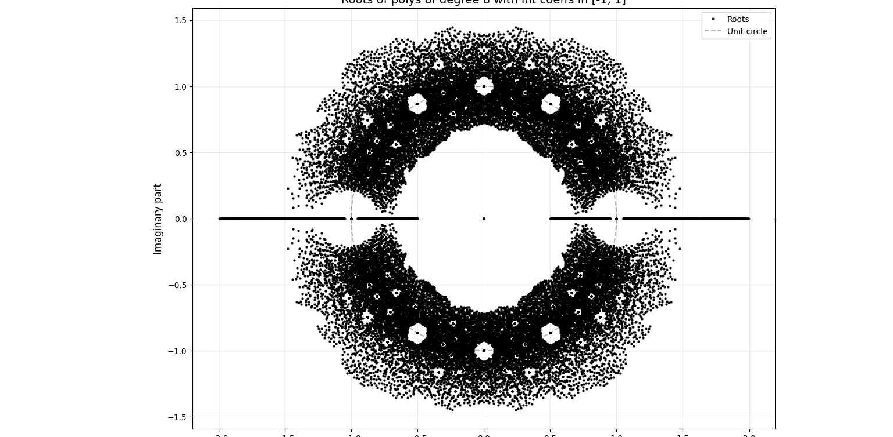

# AggregateRoots

Visualizes the distribution of complex roots aggregated over all monic polynomials of a given degree with bounded integer coefficients.

For each degree, every possible polynomial with coefficients in `[-bound, bound]` is generated and its roots are plotted on the complex plane. The result reveals beautiful fractal-like patterns in how polynomial roots cluster.

**Example output (degree 1–9, coefficients in [-1, 1]):**



---

## Project Structure

```
AggregateRoots/
├── src/
│   ├── root_pattern.py        # Static plot of root distributions
│   ├── root_interact.py       # Interactive explorer with zoom/pan
│   └── root_animation.py      # Animated visualization (requires Manim)
├── output/                    # Sample generated images
├── media/                     # Manim animation output
├── manim.cfg                  # Manim configuration
├── requirements.txt           # Core dependencies
├── requirements-animation.txt # Animation dependency (Manim)
└── README.md
```

---

## Setup Guide

This guide assumes no prior experience. Follow each step carefully.

### Step 1 — Install Python

You need **Python 3.9 or newer**.

- **Check if you already have it:**
  ```bash
  python3 --version
  ```
  If this prints `Python 3.9.x` or higher, skip to Step 2.

- **Install Python (if needed):**
  - Go to [https://www.python.org/downloads/](https://www.python.org/downloads/)
  - Download the latest stable release and run the installer
  - On the Windows installer, check **"Add Python to PATH"** before clicking Install

### Step 2 — Get the Code

Open a terminal (Mac/Linux) or Command Prompt (Windows) and run:

```bash
git clone https://github.com/eknzie/AggregateRoots.git
cd AggregateRoots
```

> Don't have `git`? Download it from [https://git-scm.com/downloads](https://git-scm.com/downloads), or download the project as a ZIP from GitHub and unzip it.

### Step 3 — Create a Virtual Environment

A virtual environment keeps this project's dependencies isolated from the rest of your system.

```bash
python3 -m venv venv
```

### Step 4 — Activate the Virtual Environment

**Mac / Linux:**
```bash
source venv/bin/activate
```

**Windows:**
```bash
venv\Scripts\activate
```

Your terminal prompt should now show `(venv)` at the start. You'll need to do this every time you open a new terminal to work on the project.

> If you're using **VSCode**, the virtual environment activates automatically when you open the project.

### Step 5 — Install Dependencies

For the static plot and interactive explorer:
```bash
pip install -r requirements.txt
```

To also run the animation:
```bash
pip install -r requirements-animation.txt
```

**Optional — faster pan/zoom in the interactive explorer:**
```bash
pip install PyQt5
```
Then open `src/root_interact.py` and uncomment the line near the top that reads `# matplotlib.use('QtAgg')`.

---

## Running the Scripts

### Static Plot — `root_pattern.py`

Generates a single image showing all polynomial roots for degrees 1–9.

```bash
python src/root_pattern.py
```

A window will open displaying the plot. Close it to exit.

**To change the parameters**, open `src/root_pattern.py` and edit these lines near the top:

```python
abs_coeff_bound = 1        # coefficients range from -1 to 1
degrees = np.arange(1, 10) # degrees 1 through 9
```

> Higher degrees or larger bounds increase computation time significantly.

---

### Interactive Explorer — `root_interact.py`

Opens a live window where you can explore root distributions interactively.

```bash
python src/root_interact.py
```

**Controls:**

| Control | What it does |
|---|---|
| **Degree checkboxes** (1–9) | Toggle which degrees are plotted; each degree has its own colour (pink → violet rainbow) |
| **Coefficient checkboxes** (−5 to 5) | Select which integer values are allowed as coefficients |
| **Range slider** | Zooms both axes symmetrically (e.g. `2` → view from −2 to 2); keeps the plot square |
| **Dot Size slider** | Adjusts the size of every plotted dot uniformly |
| **Toolbar** (bottom of window) | Zoom into a box (left-drag), zoom out (right-drag), pan (hand icon), reset view (home icon); scroll wheel also zooms |

**Layer ordering:** lower degrees always appear on top — degree 1 is the topmost layer, degree 9 is the bottommost. This is fixed regardless of the order you check them.

**Performance notes:**
- Fast (< 1 s): degree ≤ 7 with 2–3 coefficient values selected
- Slow (several seconds): degree 8–9 or many coefficient values
- Any combination that would require > 500,000 polynomials is skipped automatically and logged to the terminal
- For smoother pan/zoom with large datasets, install PyQt5 and uncomment the backend line at the top of the file:
  ```bash
  pip install PyQt5
  ```

---

### Animated Visualization — `root_animation.py`

Generates a video that builds up the root distribution degree by degree.

Manim requires additional system libraries before you install the Python package. Follow the official guide for your OS:
[https://docs.manim.community/en/stable/installation.html](https://docs.manim.community/en/stable/installation.html)

Then run:

```bash
manim src/root_animation.py RootsDistinctPolys
```

The video is saved in `media/videos/`. By default `manim.cfg` renders at low quality for speed — change `quality = low_quality` to `quality = high_quality` in that file for a sharper result.

**To change the parameters**, open `src/root_animation.py` and edit:

```python
abs_coeff_bound = 1  # coefficients range from -1 to 1
max_degree = 8       # animate up to this degree
```

---

## Troubleshooting

**`python3: command not found`** — Try `python` instead, or reinstall Python and ensure it's on your PATH.

**`pip: command not found`** — Make sure your virtual environment is activated (Step 4).

**Plot window doesn't appear** — On Linux, try `sudo apt install python3-tk`. On Mac, ensure XQuartz is installed.

**Manim errors** — Manim depends on FFmpeg and LaTeX. See the [Manim installation docs](https://docs.manim.community/en/stable/installation.html) for your OS.
